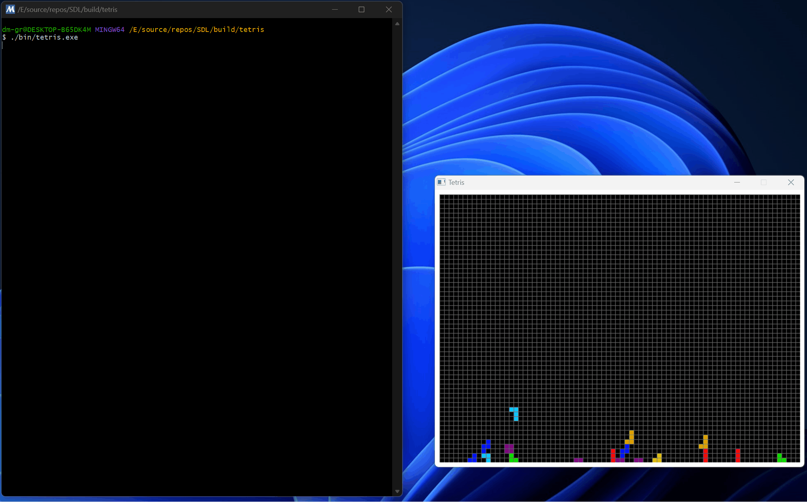

# Tetris

This is a classic Tetris game implemented in C++ using the SDL2 library.

## Demo



## Features

- Classic Tetris gameplay with 7 standard tetromino shapes.
- Colorful blocks and grid.
- Line clearing mechanics.
- Game over detection.
- Pause functionality (press Spacebar).

## Requirements

- SDL2 library
- C++ compiler (e.g., g++, clang++)

## Building

1. Make sure you have SDL2 installed on your system.
2. Clone this repository.
3. Navigate to the project directory.
4. Compile the code using a C++ compiler:
   ```bash
   g++ -o tetris game.cpp -lSDL2 
   ```
   or use `CMake`
   ```bash
   cmake .
   ```
   ```bash
   cmake --build .
   ```
5. Run the executable
   ```bash
   ./tetris
   ```

## Controls

    * Left Arrow: _Move tetromino left_
    * Right Arrow: _Move tetromino right_
    * Down Arrow: _Soft drop tetromino_
    * Up Arrow: _Rotate tetromino_
    * Spacebar: _Pause/unpause game_
    * Escape: _Quit game_